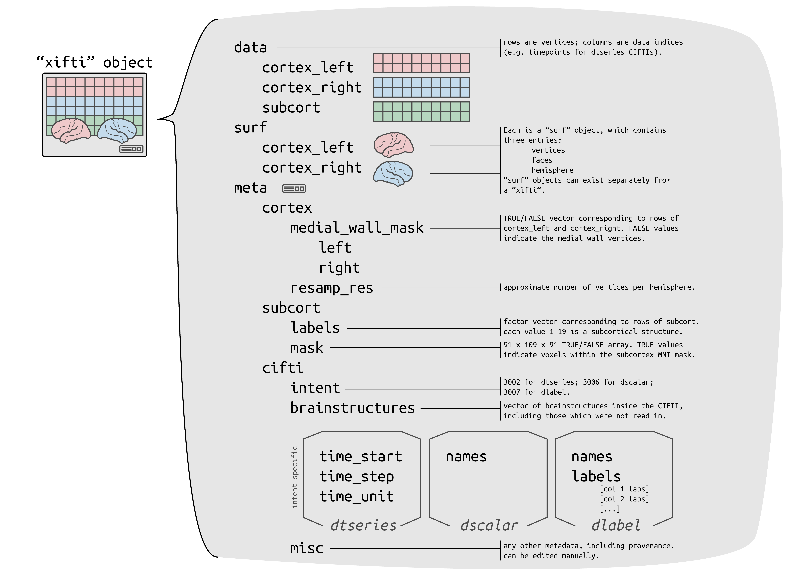
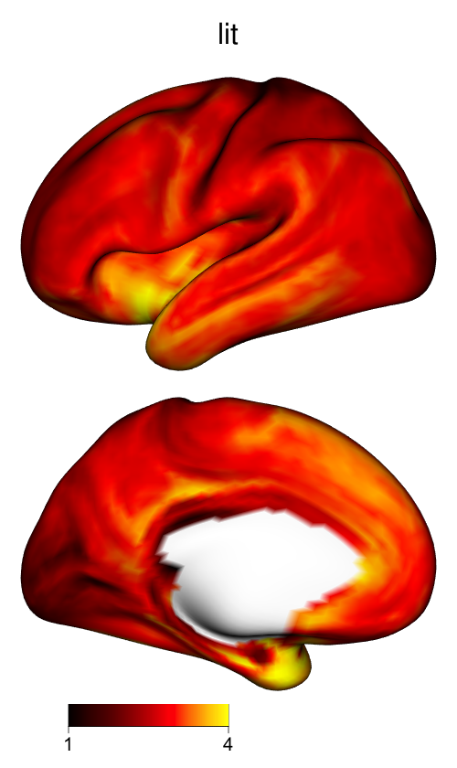
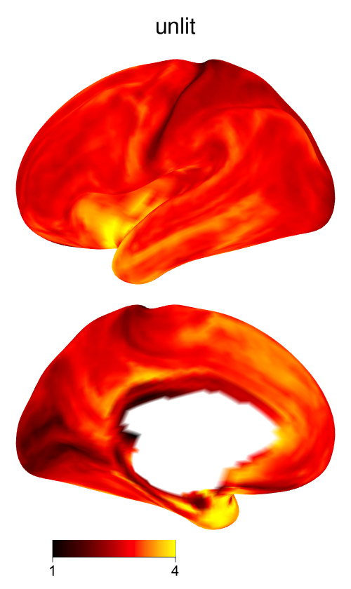

<!-- README.md is generated from README.Rmd. Please edit that file -->

# ciftiTools

<!-- badges: start -->
[](https://cran.r-project.org/package=ciftiTools)
[](https://github.com/mandymejia/ciftiTools/actions/workflows/R-CMD-check.yaml)
[](https://app.codecov.io/gh/mandymejia/ciftiTools?branch=master)
<!-- badges: end -->

CIFTI files contain brain imaging data in "grayordinates," which represent the gray matter as cortical surface vertices (left and right) and subcortical voxels (cerebellum, basal ganglia, and other deep gray matter). `ciftiTools` provides a unified environment for reading, writing, visualizing and manipulating CIFTI-format data. It supports the "dscalar," "dlabel," and "dtseries" intents. Grayordinate data is read in as a `"xifti"` object, which is structured for convenient access to the data and metadata, and includes support for surface geometry files to enable spatially-dependent functionality such as static or interactive visualizations and smoothing.

## Citation

If you use `ciftiTools`, please cite our [paper](https://doi.org/10.1016/j.neuroimage.2022.118877):

> Pham, D. D., Muschelli, J., & Mejia, A. F. (2022). ciftiTools: A package for reading, writing, visualizing, and manipulating CIFTI files in R. NeuroImage, 250, 118877.

You can also obtain citation information from within R like so:

``` r
citation("ciftiTools")
```

## Installation

You can install `ciftiTools` from [CRAN](https://cran.r-project.org/) with:

``` r
install.packages("ciftiTools")
```

Additionally, most of the `ciftiTools` functions require the Connectome Workbench, which can be installed from the [HCP website](https://www.humanconnectome.org/software/get-connectome-workbench).

## Quick start guide

``` r
# Load the package and point to the Connectome Workbench --------
library(ciftiTools)
ciftiTools.setOption("wb_path", "path/to/workbench")

# Read and visualize a CIFTI file -------------------------------
cifti_fname <- ciftiTools::ciftiTools.files()$cifti["dtseries"]
surfL_fname <- ciftiTools.files()$surf["left"]
surfR_fname <- ciftiTools.files()$surf["right"]

xii <- read_cifti(
  cifti_fname, 
  surfL_fname=surfL_fname, surfR_fname=surfR_fname,
  resamp_res=4000
)

view_xifti_surface(xii) # or plot(xii)
# view_xifti_volume(xii) if subcortex is present

# Access CIFTI data ---------------------------------------------
cortexL <- xii$data$cortex_left
cortexL_mwall <- xii$meta$medial_wall_mask$left
cortexR <- xii$data$cortex_right
cortexR_mwall <- xii$meta$medial_wall_mask$right
# subcortVol <- xii$data$subcort
# subcortLabs <- xii$meta$subcort$labels
# subcortMask <- xii$meta$subcort$mask
surfL <- xii$surf$cortex_left
surfR <- xii$surf$cortex_right

# Create a `"xifti"` from data ----------------------------------
xii2 <- as.xifti(
  cortexL=cortexL, cortexL_mwall=cortexL_mwall,
  cortexR=cortexR, cortexR_mwall=cortexR_mwall,
  #subcortVol=subcortVol, subcortLabs=subcortLabs,
  #subcortMask=subcortMask,
  surfL=surfL, surfR=surfR
)

# Write a CIFTI file --------------------------------------------
write_cifti(xii2, "my_cifti.dtseries.nii")
```

## Vignette

See [this link](https://htmlpreview.github.io/?https://github.com/mandymejia/ciftiTools/blob/master/vignettes/ciftiTools_vignette.html) to view the tutorial vignette.

## List of commonly-used functions

Basics: reading, plotting, writing

* `ciftiTools.setOption`: Necessary to point to the Connectome Workbench each time `ciftiTools` is loaded.
* `read_cifti`: Read in a CIFTI file as a `"xifti"` object.
* `view_xifti` Plot the cortex and/or subcortex. Has many options for controlling the visualization.
* `write_cifti`: Write a `"xifti"` object to a CIFTI file. 

Manipulating CIFTI files

* `resample_cifti`: Resample to a different resolution.
* `separate_cifti`: Separate a CIFTI file into GIFTI and NIFTI files.
* `smooth_cifti`: Smooth the data along the surface.
* (Use `run_wb_cmd` to execute Connectome Workbench commands from R)

Manipulating `"xifti"` objects

* `apply_xifti`: Similar to `base::apply`. 
* `combine_xifti`: Combine `"xifti"`s with non-overlapping brain structures.
* `convert_xifti`: Convert between dlabel, dscalar, and dtseries.
* `impute_xifti`: Impute data values from neighboring vertices/voxels.
* `merge_xifti`: Concatenate `"xifti"`s. 
* `move_from_mwall`: Convert the medial wall mask to a data value, deleting the mask.
* `move_to_mwall`: Mask out a particular data value.
* `newdata_xifti`: Replace the data values.
* `resample_xifti`: Resample to a different resolution.
* `scale_xifti`: Similar to `base::scale`.
* `select_xifti`: Rearrange the columns to reorder, take a subset, or repeat them.
* `smooth_xifti`: Smooth the data along the surface.
* `transform_xifti`: Apply a vectorizable function.

Surface gemoetry

* `load_surf`: Load a surface geometry included in the package. 
* `read_surf`: Read in a GIFTI surface geometry file as a `"surf"` object.
* `write_surf`: Write a `"surf"` object to a GIFTI surface geometry file. 

Parcellations

* `apply_parc`: Apply a function to each parcel separately. 
* `load_parc`: Load a parcellation included in the package.

See `NAMESPACE` for a full list of all exported functions.

## Illustrations

{width=65%}

{width=65%}

{width=25%}


## FAQ

#### Why is a CIFTI file that has been read in called a `"xifti"`?

The `"xifti"` object is a general interface for not only CIFTI files, but also GIFTI and NIFTI files. For example, we can plot a surface GIFTI:

``` r
gii_surf <- read_surf(ciftiTools.files()$surf["left"])
xii <- as.xifti(surfL=gii_surf)
plot(xii)
```

We can also convert metric GIFTI files and/or NIFTI files to CIFTI files (or vice versa) using the `"xifti"` object as an intermediary. 

#### How do I convert volumetric cortical data in NIFTI format to surface-based cortical data in CIFTI format?

There are options from other software packages including the [Connectome Workbench](https://www.humanconnectome.org/software/workbench-command/-volume-to-surface-mapping), [FreeSurfer](https://surfer.nmr.mgh.harvard.edu/fswiki/mri_vol2surf), [ciftify](https://edickie.github.io/ciftify/#/03b_cifti-for-your_fmri), and [Nilearn](https://nilearn.github.io/stable/modules/generated/nilearn.surface.vol_to_surf.html).

#### How do I convert volumetric subcortical data from NIFTI format to CIFTI format? 

Use the Connectome Workbench command [-cifti-create-dense-from-template](https://www.humanconnectome.org/software/workbench-command/-cifti-create-dense-from-template).

#### How do I visualize cortical data without applying shading to the mesh geometry?

The 3D shading may make certain plots more difficult to interpret, if the color scale varies from dark to light: darker regions might be in a shadow, or their values might be lower. To skip shading, use the argument `material=list(lit=FALSE)` to `view_xifti_surface`.

{width=14%} {width=14%}

#### How do I get `VoxelIndicesIJK` or the MNI coordinates for the subcortex?

For a `"xifti"` object `xii` with subcortical data, the mask of data locations is saved in `xii$meta$subcort$mask`. To obtain the array coordinates of the in-mask locations, use `which(xii$meta$subcort$mask, arr.ind=TRUE) - 1`. This matrix has each subcortical voxel along the rows, and its I, J, and K array coordinates along the three columns. 1 is subtracted because the coordinates should begin with 0 rather than 1. It's equivalent to the original CIFTI metadata entry `VoxelIndicesIJK`. To convert array coordinates to MNI coordinates, multiply by the transformation matrix `xii$meta$subcort$trans_mat`:

```
VoxIJK <- which(xii$meta$subcort$mask, arr.ind=TRUE) - 1
VoxIJK <- cbind(VoxIJK, 1) # for 4th col of transform mat (translation)
VoxXYZ <- t(xii$meta$subcort$trans_mat[seq(3),] %*% t(VoxIJK)) # MNI coords
```

## Related R extensions

* NIFTI files: [`oro.nifti`](https://CRAN.R-project.org/package=oro.nifti), [`RNifti`](https://CRAN.R-project.org/package=RNifti)
* GIFTI files: [`gifti`](https://CRAN.R-project.org/package=gifti)
* CIFTI files: [`cifti`](https://CRAN.R-project.org/package=cifti) can read in any CIFTI file, whereas `ciftiTools` provides a user-friendly interface for CIFTI files with the dscalar, dlabel, and dtseries intents only.
* Other structural neuroimaging files: [`fsbrain`](https://CRAN.R-project.org/package=fsbrain)
* xml files: [`xml2`](https://CRAN.R-project.org/package=xml2)
* Interactive 3D rendering: [`rgl`](https://CRAN.R-project.org/package=rgl) 

## Data acknowledgement

The following data are included in the package for convenience:

Example CIFTI files provided by [NITRC](https://www.nitrc.org/projects/cifti/).

Cortical surfaces provided by the HCP, according to the [Data Use Terms](https://www.humanconnectome.org/study/hcp-young-adult/document/wu-minn-hcp-consortium-open-access-data-use-terms):

> Data were provided [in part] by the Human Connectome Project, WU-Minn Consortium (Principal Investigators: David Van Essen and Kamil Ugurbil; 1U54MH091657) funded by the 16 NIH Institutes and Centers that support the NIH Blueprint for Neuroscience Research; and by the McDonnell Center for Systems Neuroscience at Washington University.

Several parcellations provided by [Thomas Yeo's Computational Brain Imaging Group (CBIG)](https://github.com/ThomasYeoLab/CBIG/tree/master/stable_projects/brain_parcellation):

1. Yeo, B. T. T. et al. The organization of the human cerebral cortex estimated by intrinsic functional connectivity. J Neurophysiol 106, 1125–1165 (2011).
2. Schaefer, A. et al. Local-Global Parcellation of the Human Cerebral Cortex from Intrinsic Functional Connectivity MRI. Cereb Cortex 28, 3095–3114 (2018).
3. Kong, R. et al. Individual-Specific Areal-Level Parcellations Improve Functional Connectivity Prediction of Behavior. Cerebral Cortex (2021).
